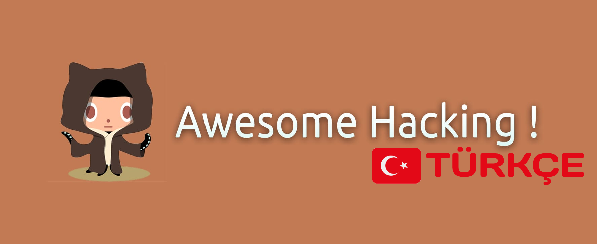

# [Awesome Hacking Türkçe](https://github.com/kayracnky/Awesome-Hacking-Turkce)

**Hackerlar, pentesterlar ve güvenlik araştırmacıları için harika listelerden oluşan bir koleksiyon.**

Sizin [katkılarınıza](contributing.md) her zaman açığız!

Repo | Açıklama
---- | ----
[Android Güvenliği](https://github.com/ashishb/android-security-awesome) | Android güvenliği ile ilgili kaynaklar koleksiyonu
[Aplikasyon Güvenliği](https://github.com/paragonie/awesome-appsec) | Aplikasyon güvenliği hakkında bilgi edinmek için kaynaklar
[Varlık Keşfi](https://github.com/redhuntlabs/Awesome-Asset-Discovery) | Bir güvenlik değerlendirmesi çalışmasının varlık keşfi aşamasında yardımcı olan kaynakların listesi
[Bug Bounty](https://github.com/djadmin/awesome-bug-bounty) | Bug Bounty programlarının listesi ve Bug Bounty avcılarından gelen yazılar
[Capsulecorp Pentest](https://github.com/r3dy/capsulecorp-pentest) | Vagrant+Ansible sanal ağ sızma testi laboratuvarı. Royce Davis'in "Ağ Sızma Testi Sanatı" kitabının tamamlayıcısı
[CTF (Bayrağı Ele Geçir)](https://github.com/apsdehal/awesome-ctf) | CTF framework, kütüphane ve yazılımlarının listesi
[Siber Yetenekler](https://github.com/joe-shenouda/awesome-cyber-skills) | Siber becerilerinizi yasal ve güvenli bir şekilde geliştirebileceğiniz bilgisayar korsanlığı ortamlarının derlenmiş listesi
[DevSecOps](https://github.com/devsecops/awesome-devsecops) | Topluluk deneyleri ve katkılarının yardımıyla harika DevSecOps araçlarının listesi
[Gömülü Sistem ve Nesnelerin İnterneti Güvenliği](https://github.com/fkie-cad/awesome-embedded-and-iot-security) | Gömülü Sistem ve Nesnelerin İnterneti güvenliği hakkında harika kaynakların derlenmiş bir listesi
[Exploit Geliştirme](https://github.com/FabioBaroni/awesome-exploit-development) | Exploit geliştirme hakkında bilgi edinmek için kaynaklar
[Fuzzing](https://github.com/secfigo/Awesome-Fuzzing) | Fuzzing ve kök neden analizi gibi Exploit geliştirmenin ilk aşamalarını öğrenmek için fuzzing kaynaklarının listesi
[Hacking](https://github.com/carpedm20/awesome-hacking) | Harika Hacking eğitimleri, araçlar ve kaynaklar
[Hacking Kaynakları](https://github.com/vitalysim/Awesome-Hacking-Resources) | Sizi daha iyi hale getirmek için hacking / sızma testi kaynakları koleksiyonu!
[Honeypots (Bal Küpleri)](https://github.com/paralax/awesome-honeypots) | Honeypot kaynaklarının listesi
[Incident Response](https://github.com/meirwah/awesome-incident-response) | Incident Response için araçların listesi
[Industrial Control System Security](https://github.com/hslatman/awesome-industrial-control-system-security) | Endüstriyel Kontrol Sistemi (ICS) güvenliği ile ilgili kaynakların listesi
[InfoSec](https://github.com/onlurking/awesome-infosec) | InfoSec kursları ve eğitim kaynaklarının listesi
[IoT Hacks](https://github.com/nebgnahz/awesome-iot-hacks) | Nesnelerin İnterneti alanındaki Hack'lerin koleksiyonu
[Mainframe Hacking](https://github.com/samanL33T/Awesome-Mainframe-Hacking) | Mainframe hacking/pentesting kaynaklarının listesi
[Malware Analysis](https://github.com/rshipp/awesome-malware-analysis) | Malware analizi araçları ve kaynaklarının listesi
[OSINT](https://github.com/jivoi/awesome-osint) | Açık Kaynak İstihbarat (OSINT) araçları ve kaynaklarının listesi
[OSX ve iOS Güvenliği](https://github.com/ashishb/osx-and-ios-security-awesome) | OSX ve iOS ile ilgili güvenlik araçları
[Pcaptools](https://github.com/caesar0301/awesome-pcaptools) | Ağ izlerini işlemek için bilgisayar bilimleri alanında geliştirilen araçlar koleksiyonu
[Pentest](https://github.com/enaqx/awesome-pentest) | Penetrasyon testi kaynakları, araçları ve diğer parlak şeylerin listesi
[PHP Güvenliği](https://github.com/ziadoz/awesome-php#security) | Güvenli rastgele sayılar oluşturmak, verileri şifrelemek ve güvenlik açıklarını taramak için kütüphaneler
[Gerçek Zamanlı İletişim Hacking ve Pentest Kaynakları](https://github.com/EnableSecurity/awesome-rtc-hacking) | VoIP, WebRTC ve VoLTE güvenliği ile ilgili konuları kapsayan kaynaklar
[Kırmızı Ekip](https://github.com/yeyintminthuhtut/Awesome-Red-Teaming) | Kırmızı Ekip / Kırmızı Ekipman Kaynaklarının listesi
[Reversing](https://github.com/fdivrp/awesome-reversing) | Harika tersine mühendislik kaynaklarının listesi
[Reinforcement Learning for Cyber Security](https://github.com/Limmen/awesome-rl-for-cybersecurity) | Siber güvenlik için pekiştirmeli öğrenme kaynaklarının listesi
[Sec Talks](https://github.com/PaulSec/awesome-sec-talks) | Harika güvenlik konuşmalarının listesi
[SecLists](https://github.com/danielmiessler/SecLists) | Güvenlik değerlendirmelerinde kullanılan çeşitli türlerde listelerin koleksiyonu
[Security](https://github.com/sbilly/awesome-security) | Güvenlikle ilgili yazılımlar, kütüphaneler, belgeler, kitaplar, kaynaklar ve harika şeylerin koleksiyonu
[Serverless Güvenlik](https://github.com/puresec/awesome-serverless-security/) | Serverless güvenlik ile ilgili kaynakların koleksiyonu
[Sosyal Mühendislik](https://github.com/v2-dev/awesome-social-engineering) | Harika sosyal mühendislik kaynaklarının listesi
[Statik Analiz](https://github.com/mre/awesome-static-analysis) | Çeşitli programlama dilleri için statik analiz araçlarının, linters ve kod kalitesi denetçilerinin listesi
[The Art of Hacking Serisi](https://github.com/The-Art-of-Hacking/h4cker) | Siber güvenlik ile ilgili binlerce referans ve kaynağı içeren kaynaklar listesi
[Tehdit İstihbaratı](https://github.com/hslatman/awesome-threat-intelligence) | Harika tehdit istihbaratı kaynaklarının listesi
[Araç Güvenliği](https://github.com/jaredthecoder/awesome-vehicle-security) | Araç güvenliği ve araba hackleme hakkında kaynaklar
[Zafiyet Araştırması](https://github.com/re-pronin/awesome-vulnerability-research) | Zafiyet Araştırması hakkında kaynakların listesi
[Web Hacking](https://github.com/infoslack/awesome-web-hacking) | Web uygulaması güvenliği ile ilgili kaynakların listesi
[Windows Exploitation - İleri Seviye](https://github.com/yeyintminthuhtut/Awesome-Advanced-Windows-Exploitation-References) | İleri Seviye Windows Exploitation kaynaklarının listesi
[WiFi Arsenal](https://github.com/0x90/wifi-arsenal) | 802.11 hacking için çeşitli yararlı ve yararsız araçların paketi
[YARA](https://github.com/InQuest/awesome-yara) | Harika YARA kuralları, araçlar ve insanlar hakkında kaynakların listesi
[Hacker Yol Haritası](https://github.com/sundowndev/hacker-roadmap) | Amatör pen testerlar için bir kılavuz ve hacking araçları, kaynaklar ve etik hacking uygulamaları için koleksiyon

## Diğer Faydalı Depolar

Depo | Açıklama
---- | ----
[Adversarial Machine Learning](https://github.com/yenchenlin/awesome-adversarial-machine-learning) | Harika karşıt makine öğrenimi kaynaklarının derlenmiş listesi
[AI Security](https://github.com/RandomAdversary/Awesome-AI-Security) | Yapay zeka güvenliği kaynaklarının derlenmiş listesi
[API Security Checklist](https://github.com/shieldfy/API-Security-Checklist) | API'nizi tasarlarken, test ederken ve yayımlarken en önemli güvenlik önlemlerinin kontrol listesi
[APT Notes](https://github.com/kbandla/APTnotes) | APT kampanyaları hakkında çeşitli kamuya açık belgeler, beyaz bültenler ve makaleler
[Bug Bounty Reference](https://github.com/ngalongc/bug-bounty-reference) | Hata ödülleri yazıları listesi, hata doğasına göre kategorize edilmiştir
[Cryptography](https://github.com/sobolevn/awesome-cryptography) | Kriptografi kaynakları ve araçları
[CTF Tool](https://github.com/SandySekharan/CTF-tool) | Capture The Flag (CTF) çerçeveleri, kütüphaneleri, kaynakları ve yazılımları listesi
[CVE PoC](https://github.com/qazbnm456/awesome-cve-poc) | CVE Proof of Concept (PoC) listesi
[Detection Lab](https://github.com/clong/DetectionLab) | Güvenlik araçları ve günlükleme en iyi uygulamaları ile dolu bir laboratuvar ortamı oluşturmak için Vagrant & Packer betikleri
[Forensics](https://github.com/Cugu/awesome-forensics) | Harika adli analiz araçları ve kaynakları listesi
[Free Programming Books](https://github.com/EbookFoundation/free-programming-books) | Geliştiriciler için ücretsiz programlama kitapları
[Gray Hacker Resources](https://github.com/bt3gl/Gray-Hacker-Resources) | CTF'ler, savaş oyunları, pentest için faydalıdır
[GTFOBins](https://gtfobins.github.io) | Bir saldırganın yerel güvenlik kısıtlamalarını aşmak için kullanabileceği Unix ikili dosyalarının derlenmiş listesi
[Hacker101](https://github.com/Hacker0x01/hacker101) | HackerOne tarafından sunulan ücretsiz web güvenliği dersi
[Infosec Getting Started](https://github.com/gradiuscypher/infosec_getting_started) | Bilgi güvenliği hakkında öğrenmek isteyenler için kaynaklar, belgeler, bağlantılar vb. koleksiyonu
[Infosec Reference](https://github.com/rmusser01/Infosec_Reference) | "Sıkıcı Olmayan" Bilgi Güvenliği Referansı
[IOC](https://github.com/sroberts/awesome-iocs) | Tehdit belirtisi (IOC) kaynakları koleksiyonu
[Linux Kernel Exploitation](https://github.com/xairy/linux-kernel-exploitation) | Linux çekirdek sıkıştırması ve sömürüsü ile ilgili bir dizi bağlantı
[Lockpicking](https://github.com/meitar/awesome-lockpicking) | Kilitlerin, kasaların ve anahtarların güvenliği ve tehlikeye atılması ile ilgili kaynaklar
[Machine Learning for Cyber Security](https://github.com/jivoi/awesome-ml-for-cybersecurity) | Siber güvenlik için makine öğrenmesi ile ilgili araçlar ve kaynakların derlenmiş listesi
[Payloads](https://github.com/foospidy/payloads) | Web saldırı yüklerinin koleksiyonu
[PayloadsAllTheThings](https://github.com/swisskyrepo/PayloadsAllTheThings) | Web Uygulaması Güvenliği ve Pentest/CTF için kullanışlı yüklerin ve baypasların listesi
[Pentest Cheatsheets](https://github.com/coreb1t/awesome-pentest-cheat-sheets) | Pentest için faydalı olan cheat sheet'lerin koleksiyonu
[Pentest Wiki](https://github.com/nixawk/pentest-wiki) | Pentester'lar / araştırmacılar için ücretsiz çevrimiçi güvenlik bilgi kütüphanesi
[Probable Wordlists](https://github.com/berzerk0/Probable-Wordlists) | Şifre oluşturma ve test etme için oluşturulmuş, olasılığa göre sıralanmış kelime listeleri
[Resource List](https://github.com/FuzzySecurity/Resource-List) | Gevşek bir şekilde kategorize edilmiş faydalı GitHub projelerinin koleksiyonu
[Reverse Engineering](https://github.com/onethawt/reverseengineering-reading-list) | Tersine mühendislik makaleleri, kitaplar ve belgeler listesi
[RFSec-ToolKit](https://github.com/cn0xroot/RFSec-ToolKit) | Radyo frekansı iletişim protokolü hack araçlarının koleksiyonu
[Security Cheatsheets](https://github.com/andrewjkerr/security-cheatsheets) | Çeşitli infosec araçları ve konuları için cheat sheet'lerin koleksiyonu
[Security List](https://github.com/zbetcheckin/Security_list) | Eğlenceli ve karlı güvenlik listesi
[Shell](https://github.com/alebcay/awesome-shell) | Shell kullanımını en iyi şekilde yapabilmek için komut satırı çerçeveleri, araçları, rehberleri ve gadget'larının listesi
[ThreatHunter-Playbook](https://github.com/Cyb3rWard0g/ThreatHunter-Playbook) | Avlanma kampanyaları için teknikler ve hipotezlerin geliştirilmesine yardımcı olacak bir tehdit avcısı rehberi
[Web Security](https://github.com/qazbnm456/awesome-web-security) | Web güvenliği materyalleri ve kaynaklarının derlenmiş listesi
[Vulhub](https://github.com/vulhub/vulhub) | Docker-Compose tabanlı önceden hazırlanmış güvenlik açıklarına sahip ortamlar

## Daha Fazlasına İhtiyacınız Var mı?

Günlük olarak güvenlikle ilgili ilginç GitHub depolarına dair güncellemeler almak için **Hack with GitHub**'ı favori sosyal medya hesabınızda takip edin.
 - Twitter: [@HackwithGithub](https://twitter.com/HackwithGithub)
 - Facebook: [HackwithGithub](https://www.facebook.com/HackwithGithub)

## Contributions

Please have a look at [contributing.md](contributing.md)
